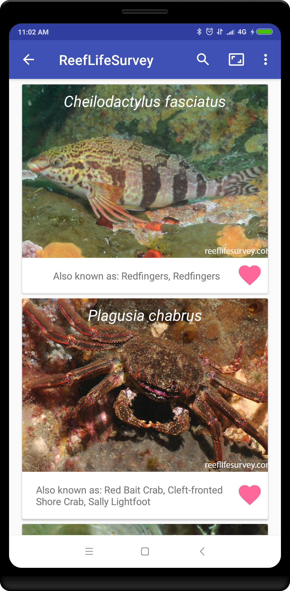
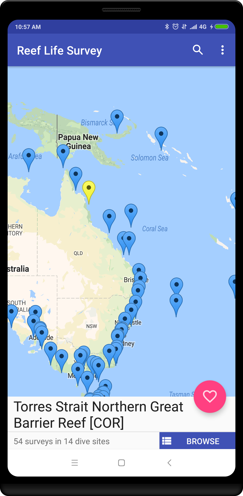
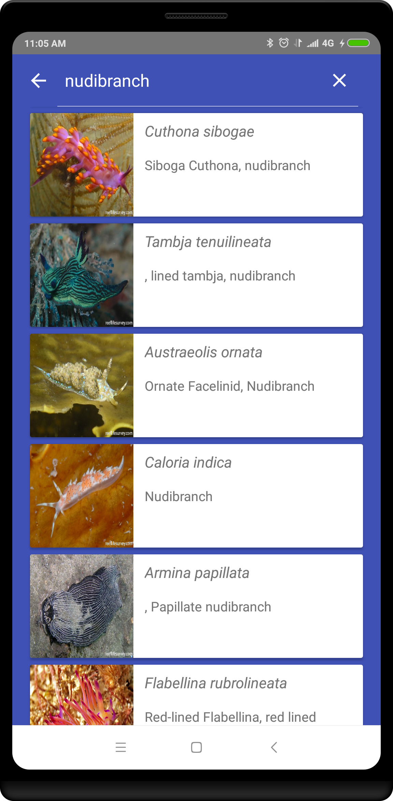

# ReefLifeSurvey - Species Explorer

Android application for browsing fish species and survey site locations based on data collected by the Australian non-profit [ReefLifeSurvey](www.reeflifesurvey.com)

### Summary

ReefLifeSurvey brings the world's coral reefs and tropical fish to life!

**[Install on Google Play (Beta Testing)](https://play.google.com/apps/testing/me.jludden.reeflifesurvey)**

**[Try it in the web browser] (https://appetize.io/embed/eqepaxgutfcqpr5yxud87f2u6r?device=nexus5&scale=75&orientation=portrait&osVersion=7.1)**

### Screenshots

### Contributing

Feel free to fork! Ideally any new classes will be written in Kotlin. For an example written in Kotlin with MVP architecture and [RxAndroid](https://github.com/ReactiveX/RxAndroid), please see [Search Activity](app/src/main/java/me/jludden/reeflifesurvey/search) and related classes.

Also, please consider donating to [ReefLifeSurvey](https://reeflifesurvey.com/how-to/)

### Authors

* [Jason Ludden](https://www.linkedin.com/in/jason-ludden/)

### License

This project is licensed under the GNU General Public License - see the [LICENSE.md](LICENSE) file for details

### Acknowledgments

* Heavily inspired by, and using the same datasource, as [Yanir Seroussi's](https://yanirseroussi.com/) [RLS frequency-explorer](https://github.com/yanirs/yanirs.github.io/tree/master/tools/rls)
* [Plaid](https://github.com/nickbutcher/plaid)
* [Android Architecture Blueprints](https://github.com/googlesamples/android-architecture)